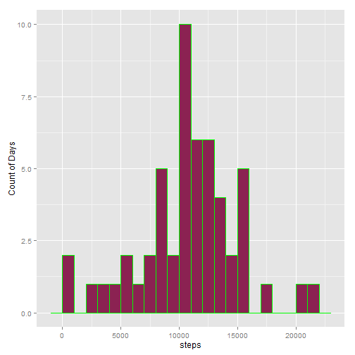
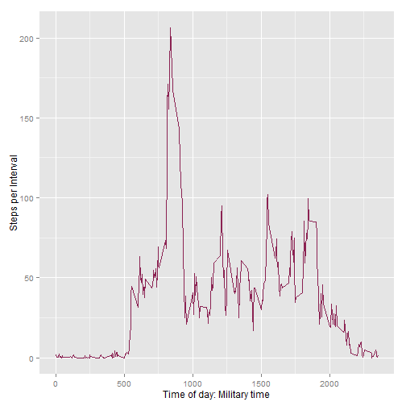
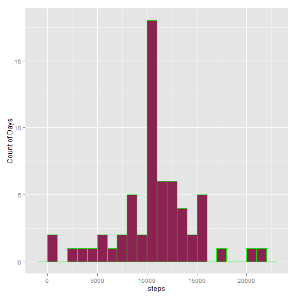
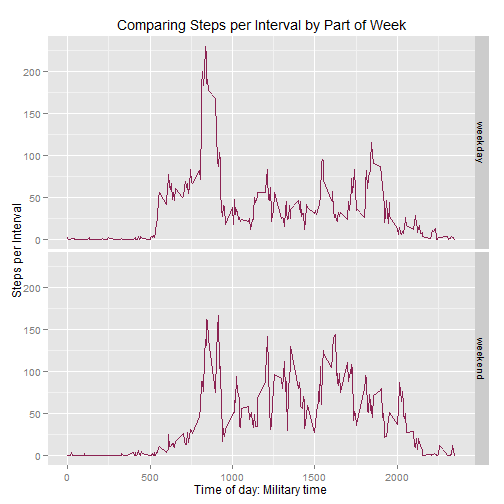

# Reproducible Research: Peer Assessment 1

*dcmarkos*   


## Loading and preprocessing the data


```r
    library(dplyr)
    library(ggplot2)
```


```r
    act_df<-read.csv("activity.csv") # read in as data frame
    act_dft<-tbl_df(act_df) # convert to data frame table for the dplyr operations
    steps_by_day<-summarise(group_by(act_dft,date),steps = sum(steps)) # This preserves NAs which will
                                                                       # later be removed.
    sbd_na0<-summarise(group_by(act_dft,date),steps = sum(steps,na.rm=TRUE)) # This converts NAs to 0. 
                                                                             # Not a good idea. See below.
    steps_by_interval<-summarise(group_by(act_dft,interval),steps = mean(steps,na.rm=TRUE))
```

## What is mean total number of steps taken per day?

```r
    p1<-ggplot(steps_by_day,aes(steps),width = 10)
    p1<- p1 + geom_bar(colour="green",fill="violetred4",binwidth=1000) + labs(y ="Count of Days")
    p1
```

 

```r
# With na entries removed from dft that perserved NAs:
    mean <-as.integer(mean(steps_by_day$steps,na.rm = TRUE)*100)/100
    median <-as.integer(median(steps_by_day$steps,na.rm = TRUE)*100)/100
# With dtf that converted NAs to 0:
    meanNA <-as.integer(mean(sbd_na0$steps)*100)/100
    medianNA <-as.integer(median(sbd_na0$steps)*100)/100
```
**For total steps taken per day, the mean is 10766.18 **
**and the median is 10765. **
**Note: these values were obtained by removing na entries.**

*With na entries converted to 0, mean = 9354.22 * 
*and median = 10395. This is a misleading result.*

## What is the average daily activity pattern?

```r
    p2<-ggplot(steps_by_interval,aes(interval,steps)) + geom_line(colour="violetred4")
    p2 <- p2 + labs(y = "Steps per Interval") + labs(x = "Time of day: Military time")
    p2
```

 

```r
    x<-max(steps_by_interval$steps) # creates a vector for use in the next line
    max_interval<-filter(steps_by_interval,steps == x[1]) # creates a one-line data frame 
                                                          # with the interval where the max occurs
    integerX<-as.integer(format(max_interval[[1,1]])) # this and the next two lines are used 
                                                      # to format the time of the interval
    hour<-integerX%/%100
    minute<-integerX%%100
```
**The maximum average number of steps in any five-minute interval is 206.2 
and this max occurs at 8:35.**

## Imputing missing values


```r
    na_count<-tally(filter(act_dft,is.na(steps)))
```
**The total number of missing values is 2304.**


```r
# I use the mean of the steps found in the steps_by_interval table. I add a variable round_steps 
# based on the existing steps. variable

    steps_by_interval$round_steps<-round(steps_by_interval$steps)

# The following loops through act_dft and replaces NAs with the rounded averages from the 
# steps_by_interval dft.    

    count <- 0
    num_recs <- as.numeric(tally(steps_by_interval)[[1]])
    for(s in act_dft$steps){
        count <- count + 1
        if(is.na(s)){
            if(count%%num_recs == 0){
                act_dft$steps[count]<-steps_by_interval$round_steps[num_recs]  
            }else{
                act_dft$steps[count]<-steps_by_interval$round_steps[count%%num_recs]
            }
        }
    }
    steps_by_day<-summarise(group_by(act_dft,date),steps = sum(steps)) # Recreates this dft 
                                                                       # with the filled values
    p3<-ggplot(steps_by_day,aes(steps)) + geom_bar(colour="green",fill="violetred4",binwidth=1000) 
    p3<- p3 + labs(y ="Count of Days")
    p3
```

 

```r
    mean2 <-as.integer(mean(steps_by_day$steps,na.rm = TRUE)*100)/100
    median2 <-as.integer(median(steps_by_day$steps,na.rm = TRUE)*100)/100    
```
**With imputed values for total steps taken per day, the mean is 10765.63 ** 
**and the median is 10762.**

**The before-after difference for the mean is  0.55, **
**and for the median it is 3.**

*The pattern remains the same but the y-axis values have increased due to more data.*


## Are there differences in activity patterns between weekdays and weekends?


```r
    act_dft$dow<-weekdays(as.Date(act_dft$date)) # Adds a new variable to act_dft 
                                                 # with the values "Monday" to "Sunday"
# The following is a helper function for converting days of the week to the part of the week: 
# "weekday" or "weekend"
    convert_dow<- function(x){
        if(x=="Saturday" | x=="Sunday"){
            y<-"weekend"
        }else{
            y<-"weekday"
        }
        y
    }
# The following creates a new variable temporarily called w and populates it with the dow values 
# which are then converted to pow values. The variable is then renamed pow
    act_dft$w<-act_dft$dow
    count <- 0
    for(d in act_dft$w){
        count <- count + 1
        act_dft$w[count]<-convert_dow(d)
    }
    act_dft$pow<-as.factor(act_dft$w)
# The following creates a dft that groups 288 values of interval with the 2 values of pow 
# and takes the mean of each association.
    act_pow<-aggregate(act_dft$steps,list(pow=act_dft$pow,interval=act_dft$interval),mean)
    names(act_pow)[names(act_pow)=="x"] <- "steps"
    

    p4 <- ggplot(act_pow,aes(interval, steps)) + geom_line(colour="violetred4") 
    p4 <- p4 + facet_grid(pow ~ .) 
    p4 <- p4 + labs(y = "Steps per Interval") + labs(x = "Time of day: Military time")
    p4 <- p4 + labs(title = expression("Comparing Steps per Interval by Part of Week"))
    p4
```

 

*The weekday has one large peak at around 8:30. Whereas, the weekend activity spreads more uniformly*
*throughout the day.*


